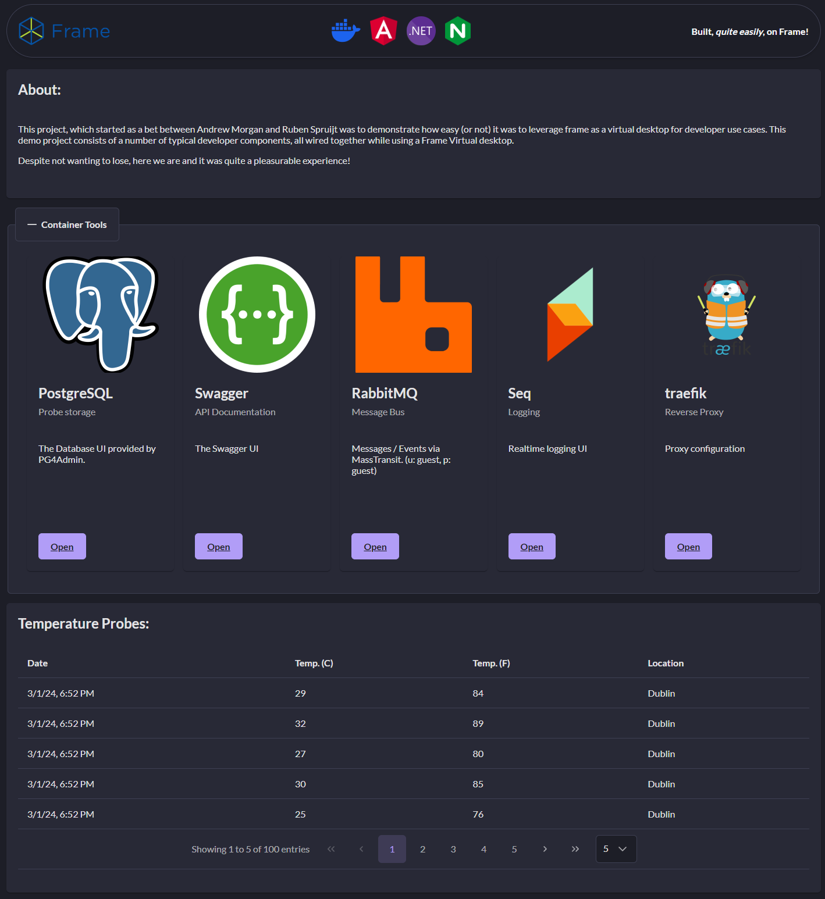

# About
This started off as a joke between Ruben Spruijt and Andrew Morgan about how viable using a virtual desktop could be to developer use cases. Not happy with certain statements I decided to take the challenge and write a demo, modern architecture application in a virtual desktop end to end.

## Architecture of this sample application.


The application itself is fairly simple: 

### Backend:

- A sample .Net worker, named probe, generates random temperature probes and emits them to the message bus (RabbitMQ + Mass Transit)
- These messages are picked up by a .Net worker called the consumer via the message bus, which are then stored in a PostGreSQL database.
- All .Net containers log to a central Seq server which you can browse to see live data.

### Front End:

The frontend is served to you on http://localhost

- we use traefik as our reverse proxy.
- we use an angular front end, hosted in Nginx.
- angular communicates with a .Net 8 Web Api (through traefik on localhost/api) to pull samples from the database.
- the .net api uses Entity framework to pull samples from a Postgres database and returns the data to Angular to serve.

The net result was really cool, to my suprise. Frame offered an excellent location for me to install my dev tools and write this sample.

## Running this project.

Pre-requisits:
- Install WSL for windows (if windows).
- Install Docker desktop.
- Open Docker desktop, to ensure docker is running.

Running the docker stack:
- Clone the repository
- Run Docker compose.
- browse to http://localhost

### Detailed steps:

```
git clone https://github.com/andyjmorgan/frame.demo.git
cd frame.demo
docker compose up -d
start-process http://localhost
```

### Example Interface:

Assuming all has gone to plan, you should be presented with this:

